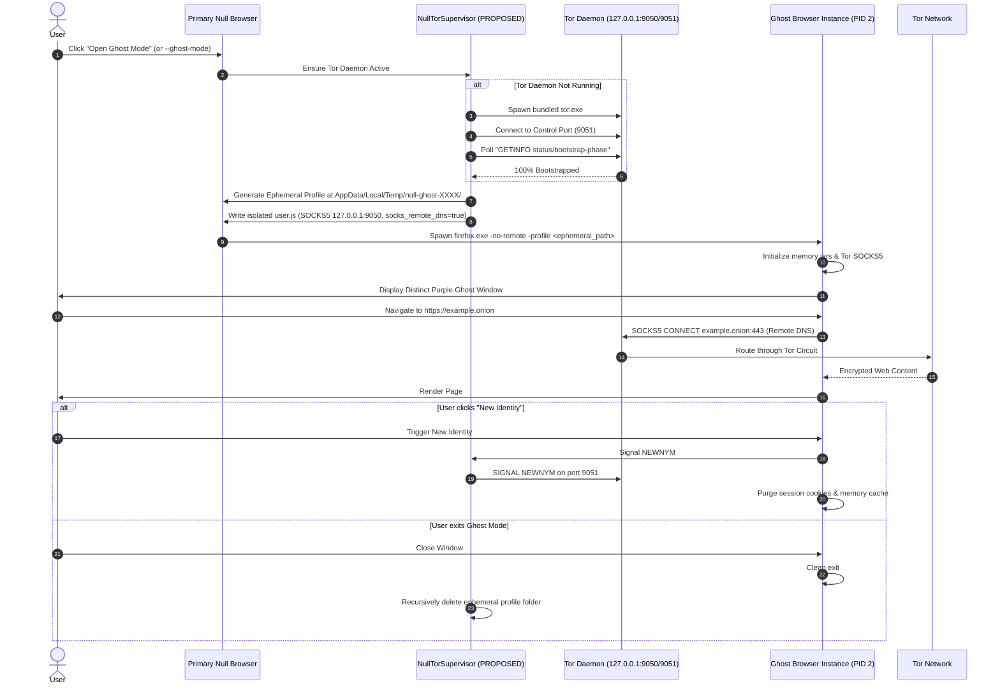
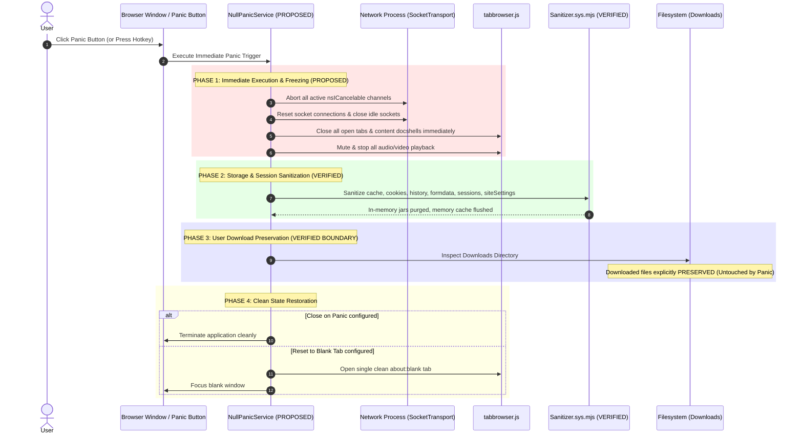

# Null Browser - System Architecture Specification (Step 4B Final Validation)
**Baseline Engine**: Mozilla Firefox ESR 153.4.0 (Commit: `22ecfc5e7cf58364a529219d419f375ecdb81ec8`)  
**Target Platforms**: Windows x86_64 (Primary Desktop), GeckoView/Android (Architecture Aligned Boundaries)  
**Status**: Step 4B Final Architecture Validation Completed  
**Source Integrity**: Unmodified pristine Firefox ESR 153.4.0 tree (`git -C firefox status` clean, 0 lines modified)

---

## 1. Architecture Overview

Null Browser is a hardened, privacy-first desktop web browser built upon the Mozilla Firefox ESR 153.4.0 codebase. Its core model eliminates the conventional "dual-mode" paradigm where users navigate between an insecure standard profile and a private window. Instead, Null Browser establishes **Private Browsing Mode as the universal default operating baseline**, ensuring that browsing history, form autofill, saved credentials, and persistent disk caches are never committed to client SQLite databases during normal execution.

For high-threat environments requiring network-level routing obfuscation and `.onion` hidden service access, Null Browser designs **Ghost Mode**—an isolated browser instance executing in a distinct OS process with an ephemeral, transient profile directory routed through a supervised local SOCKS5 Tor daemon with remote DNS resolution and Tor circuit management.

The architectural principles of Null Browser are grounded in fail-closed, defensible mechanisms:
1. **Private Mode by Default**: Non-private browsing windows are disabled; session storage and cookies reside in RAM-only structures (`CookiePrivateStorage`) dropped upon session termination.
2. **Network Layer Enforcement**: Disabling DNS AAAA resolution via preferences is recognized as necessary but insufficient for complete IPv6 suppression. A dedicated socket transport guard is designed to reject direct IPv6 literal socket connections.
3. **WebRTC Isolation**: Standard WebRTC host candidates are suppressed and proxy routing is enforced. Crucially, Null Browser identifies and overrides upstream Firefox behavior where media capture permissions expose host network addresses.
4. **Resist Fingerprinting (RFP)**: Standardized bucket quantization (uniform inner window dimensions, UTC timestamps, `en-US` locale normalization, sanitized system fonts) is utilized in preference to continuous random noise injection, which increases behavioral distinctiveness.
5. **Telemetry Elimination**: Inbound and outbound Mozilla Glean/Telemetry infrastructure, crash reporters, experiment schedulers, and activity-stream sponsored services are systematically disabled at preference and component boundaries.
6. **Privileged Control Panel Boundary**: Real-time inspection of blocking events is rendered inside a sandboxed `privilegedabout` process communicating via `JSWindowActor` IPC with parent-process aggregators, preventing any untrusted web content from reading internal browser state.

---

## 2. Architecture Diagram

```mermaid
graph TB
    subgraph UI_Layer [Presentation & Shell Layer]
        BrowserChrome[Browser Chrome Window / Tabs]
        CP_UI[about:null-browser / about:control-panel<br/>Privileged About Content Process]
        PanicTrigger[Panic Mode Action Hook / Hotkey]
    end

    subgraph IPC_Boundary [IPC & Privilege Boundary Layer]
        ActorChild[NullControlPanelChild Actor<br/>remoteType: privilegedabout]
        ActorParent[NullControlPanelParent Actor<br/>Parent Process Chrome]
        EventStream[NullEventStreamService<br/>Parent Event & Observer Hub]
    end

    subgraph Core_Subsystems [Null Browser Subsystems]
        PrivCore[privacy-core<br/>ETP, TCP, Anti-Tracking, Telemetry Cut]
        NetCore[network-core<br/>IPv6 Guard, TRR3 Fail-Closed, WebRTC Filter]
        FPCore[fingerprint-core<br/>RFP Targets, Canvas/WebGL/Font Bounds]
        LocCore[location-core<br/>Geo Denial Policy & Synthetic Provider]
        GhostCore[ghost-mode<br/>Tor Daemon Supervisor & Circuit Manager]
        StorCore[storage-core<br/>Sanitizer Orchestrator & Ephemeral Jars]
    end

    subgraph Gecko_Parent [Firefox ESR 153.4.0 Parent Process (Chrome)]
        CookieService[nsCookieService (dFPI / TCP)]
        PlacesDB[nsNavHistory / Places DB Thread]
        PermMgr[nsPermissionManager (EXPIRE_SESSION)]
        ProgListener[nsIWebProgressListener (onContentBlockingEvent)]
        SanitizerMod[Sanitizer.sys.mjs]
        PrefEngine[Preferences Service & StaticPrefList]
    end

    subgraph Network_Process [Socket Process (remoteType: socket)]
        SocketTransport[nsSocketTransportService & Literal Guard]
        HostResolver[nsHostResolver & TRRService (Mode 3)]
        SocksProxy[nsProtocolProxyService (SOCKS5 Remote DNS)]
    end

    subgraph Sandboxed_Content [Untrusted Content Processes (remoteType: web)]
        SpiderMonkey[SpiderMonkey JS Engine (UTC / Intl / Math)]
        DOM_Security[nsHTTPSOnlyUtils / Channel Classifier]
        CanvasContext[Canvas & WebGL Contexts (Quantized)]
        WebRTC_ICE[PeerConnectionImpl / nricectx]
    end

    subgraph External_Tor [Local Tor Layer (External Supervised Process)]
        TorDaemon[Supervised tor.exe Daemon (127.0.0.1:9050)]
        TorControl[Tor Control Port (127.0.0.1:9051)]
        TorNetwork[Tor Onion Relays]
    end

    BrowserChrome --> Gecko_Parent
    CP_UI <--> ActorChild
    ActorChild <== PWindowActor IPDL ==> ActorParent
    ActorParent <--> EventStream
    ProgListener --> EventStream
    CookieService --> EventStream
    HostResolver --> EventStream
    
    PanicTrigger --> StorCore
    StorCore --> SanitizerMod
    
    PrivCore --> PrefEngine
    NetCore --> SocketTransport
    NetCore --> HostResolver
    FPCore --> SpiderMonkey
    LocCore --> PermMgr

    Gecko_Parent <== IPDL ==> Network_Process
    Gecko_Parent <== IPDL ==> Sandboxed_Content

    GhostCore <== SOCKS5 ==> TorDaemon
    GhostCore <== Control Socket ==> TorControl
    TorDaemon <== Onion Routing ==> TorNetwork
```
---

## 3. Subsystem Table

| Subsystem | Null Browser Layer | Upstream Firefox ESR 153.4.0 Component | Process / Privilege Boundary | Persistence Model | Web Exposure | Control Panel Data Source | Verification Status | Status |
|---|---|---|---|---|---|---|---|---|
| **1. Private Mode Default** | `privacy-core/defaults/` | `modules/libpref/init/StaticPrefList.yaml:1856` (`browser.privatebrowsing.autostart`) | Parent Process | RAM only | None | `browser.privatebrowsing.autostart` | Source verified; Null Browser integration test planned | **PROPOSED** |
| **2. History Suppression** | `privacy-core/history/` | `toolkit/components/places/nsNavHistory.cpp:349, 584` (`places.history.enabled = false`) | Parent Process | RAM only | None | Places insertion events (0) | Source verified; Upstream test exists (`browser_visituri_nohistory.js`) | **VERIFIED** |
| **3. Password Saving Prevention** | `privacy-core/passwords/` | `toolkit/components/passwordmgr/LoginHelper.sys.mjs:442-446` (`signon.rememberSignons = false`) | Parent Process | Disabled | None | Password manager status | Source verified; Null Browser integration test planned | **PROPOSED** |
| **4. Cookie & Storage Isolation** | `privacy-core/cookie-isolation/`, `storage-core/` | `netwerk/cookie/CookiePrivateStorage.cpp`, `CookieService.cpp` (`cookieBehavior = 5`) | Parent & Socket Processes | RAM only / Partitioned | Origin-isolated | Active origin storage tree | Source verified; Null Browser integration test planned | **PROPOSED** |
| **5. Telemetry Elimination** | `privacy-core/telemetry/` | `toolkit/components/telemetry/core/TelemetryController.sys.mjs:450` | Parent Process | Disabled | None | Zero outbound pings metric | Source verified; Null Browser packet audit planned | **PROPOSED** |
| **6. HTTPS-Only Hardening** | `security-core/content-security/` | `dom/security/nsHTTPSOnlyUtils.cpp:78` (`dom.security.https_only_mode = true`) | Parent / Content Channel | None | Standard HTTPS | Upgraded request count & alerts | Source verified; Null Browser integration test planned | **PROPOSED** |
| **7. DNS / TRR Fail-Closed (Mode 3)** | `network-core/dns/` | `netwerk/dns/TRRService.cpp:322`, `TRR.cpp:550` (`network.trr.mode = 3`) | Socket Process | None | Resolvers masked | TRR status, query count, resolver IP | Source verified; Upstream test exists (`test_trr.js`) | **VERIFIED** |
| **8. IPv6 DNS AAAA Suppression** | `network-core/ip/ipv6/` | `modules/libpref/init/StaticPrefList.yaml:16589` (`network.dns.disableIPv6 = true`) | Socket Process | None | Zero AAAA queries | IPv6 DNS state indicator | Source verified; Upstream test exists (`test_dns_disable_ipv6.js`) | **VERIFIED** |
| **9. IPv6 Literal Socket Guard** | `network-core/ip/ipv6/` | `netwerk/base/nsSocketTransport2.cpp:1095` (`PR_OpenTCPSocket`) | Socket Process | None | Zero IPv6 traffic | Socket rejection event stream | Null Browser C++ / observer guard planned | **PROPOSED** |
| **10. WebRTC Host Candidate Stripping** | `network-core/webrtc/` | `dom/media/webrtc/transport/nricectx.cpp:299` (`media.peerconnection.ice.no_host = true`) | Content -> Socket Process | None | Host IPs hidden | WebRTC policy state | Source verified; Null Browser candidate test planned | **PROPOSED** |
| **11. WebRTC Proxy/Relay Routing** | `network-core/webrtc/` | `dom/media/webrtc/jsapi/PeerConnectionImpl.cpp:4210, 4500` | Content -> Socket Process | None | TURN/Relay only | Active WebRTC call table | Source verified; Null Browser proxy candidate test planned | **PROPOSED** |
| **12. WebRTC Capture IP Override** | `network-core/webrtc/` | `dom/media/webrtc/jsapi/PeerConnectionImpl.cpp:4512-4520` | Content Process | None | Constant obfuscation | Obfuscation override badge | Null Browser capture override test planned | **PROPOSED** |
| **13. Geolocation Device Denial** | `location-core/geolocation/` | `dom/geolocation/Geolocation.cpp:782` (`geo.enabled = false`, `ms-windows-location = false`) | Parent Process | Disabled | None (Denied) | Geolocation rejection log | Source verified; Upstream test exists (`test_geolocation_position_unavailable.js`) | **VERIFIED** |
| **14. Synthetic Location Injection** | `location-core/geolocation/` | `dom/system/NetworkGeolocationProvider.sys.mjs:349, 383` (Loopback synthetic JSON) | Parent Process | Static Synthetic | London, UK | Synthetic location status | Null Browser synthetic provider planned | **PROPOSED** |
| **15. Timezone & Locale Normalization**| `fingerprint-core/locale/` | `dom/base/nsGlobalWindowOuter.cpp:2064-2070`, `RFPTargets.inc:28, 40` | Content Process (SpiderMonkey)| None | UTC / en-US | Normalized locale/timezone badge | Source verified; Upstream test exists (`browser_service_worker_granular_overrides.js`)| **VERIFIED** |
| **16. Fingerprint Quantization (RFP)** | `fingerprint-core/rfp/` | `toolkit/components/resistfingerprinting/nsRFPService.cpp:630` | Content Process | None | RFP standard buckets | RFP shield status & targets | Source verified; Null Browser canvas metric test planned | **PROPOSED** |
| **17. Live Content-Blocking Event Stream**| `privacy-core/ad-blocking/` | `uriloader/base/nsIWebProgressListener.idl:372-403, 602` | Parent Process | None | Counters in CP | `nsIWebProgressListener.onContentBlockingEvent` | Source verified; Upstream test exists (`browser_protectionsUI_categories.js`) | **VERIFIED** |
| **18. Ghost Mode Profile Isolation** | `ghost-mode/profile/` | Firefox CLI `-no-remote -profile <ephemeral_dir>` | Independent Parent Process | Ephemeral temp dir | Isolated Identity | Process ID & ephemeral dir path | Multi-process launcher planned | **PROPOSED** |
| **19. Ghost Mode SOCKS5 Proxy Prefs** | `ghost-mode/tor/` | `netwerk/base/nsProtocolProxyService.cpp:1082-1087` (`socks_remote_dns = true`) | Socket Process | None | Tor exit node IP | Tor connection status | Source verified; SOCKS5 handshake test planned | **PROPOSED** |
| **20. Ghost Mode Tor Daemon Supervisor**| `ghost-mode/tor/` | External Tor daemon launcher & Control Port monitor (`127.0.0.1:9051`) | Parent Process Helper | Ephemeral Tor state | Onion Routing | Bootstrap progress % & circuit map | Null Browser supervisor implementation planned | **PROPOSED** |
| **21. .onion Resolution Routing** | `ghost-mode/tor/` | `modules/libpref/init/all.js:1546` (`network.dns.blockDotOnion = false`) | Socket Process | None | Tor Onion Service | .onion navigation indicator | Source verified; .onion resolution test planned | **PROPOSED** |
| **22. Panic Mode Network/Tab Eviction**| `storage-core/panic/` | Tab/window eviction, `nsICancelable`, `nsISocketTransportService` | Parent Process | State Wipe | Immediate Blank / Exit | Panic event execution log | Null Browser eviction service planned | **PROPOSED** |
| **23. Panic Mode In-Memory Sanitization**| `storage-core/panic/` | `browser/modules/Sanitizer.sys.mjs:160` (`Sanitizer.sanitize(...)`) | Parent Process | In-memory purge | Residuals Cleared | Storage purge verification badge | Source verified; Null Browser purge test planned | **PROPOSED** |
| **24. Panic Download Preservation** | `storage-core/panic/` | `toolkit/components/downloads/DownloadCore.sys.mjs` (Preserve user files) | Parent Process | Disk Download Folder | Unchanged Files | Downloads count | File existence assertion test planned | **PROPOSED** |
| **25. Temporary Session Permissions** | `privacy-core/permissions/` | `extensions/permissions/PermissionManager.cpp:2004-2011` (`EXPIRE_SESSION`) | Parent Process | Session/Tab bound | Prompted sites | Temporary permissions table | Source verified; Upstream test exists (`test_permmanager_expiration.js`) | **VERIFIED** |
| **26. about:null-browser Page Registration**| `browser/components/nullbrowser/`| `browser/components/about/AboutRedirector.cpp:136`, `components.conf:21` | Parent / Privileged About | None | Chrome UI | Control Panel render state | Registration patch planned | **PROPOSED** |
| **27. Privileged About IPC Boundary** | `browser/components/nullbrowser/`| `browser/components/DesktopActorRegistry.sys.mjs` (`JSWindowActor`) | Parent <-> privilegedabout | None | Chrome IPC | IPC message roundtrip latency | Source verified; Upstream test exists (`browser_privacyMetrics_actor.js`) | **VERIFIED** |
| **28. Site-Specific Protection State** | `browser/components/nullbrowser/`| `browser/base/content/browser-siteProtections.js:2203` | Parent Process | Tab Lifetime | Domain protections | Active tab protection status | Source verified; UI integration test planned | **PROPOSED** |
| **29. Windows Packaging / NSIS** | `tools/packaging/` | `browser/installer/windows/nsis/installer.nsi`, `toolkit/mozapps/installer/` | Build System / Installer | Installed Program Files| OS Integration | Installer metadata | Null Browser packaging build planned | **PROPOSED** |
| **30. GeckoView / Android Alignment** | `mobile/android/geckoview/`| `mobile/android/geckoview/` Java/Kotlin API bindings (`GeckoRuntimeSettings`)| Mobile Process Host | Mobile App Sandbox | Android GeckoView | N/A (Phase 2 Mobile) | Investigation insufficient for claim | **UNKNOWN** |
---

## 4. Verified Firefox ESR 153.4.0 Integration Points

A mechanism is designated **VERIFIED** only when it is directly confirmed in the active Firefox ESR 153.4.0 source tree **AND** its supporting upstream regression test is present in this exact repository commit. Exactly 8 mechanisms meet this strict criterion:

### 4.1 History Suppression
- **Firefox Source Path**: [`firefox/toolkit/components/places/nsNavHistory.cpp`](file:///C:/Users/Zaid/Projects/Null-Browser/firefox/toolkit/components/places/nsNavHistory.cpp#L349) (lines 349, 584)
- **Symbols / Prefs**: `places.history.enabled = false`, `nsNavHistory::CanAddURI()` checks `!IsHistoryDisabled()`
- **Process Boundary**: Parent Process (Places background database thread).
- **Upstream Test**: [`firefox/toolkit/components/places/tests/browser/browser_visituri_nohistory.js`](file:///C:/Users/Zaid/Projects/Null-Browser/firefox/toolkit/components/places/tests/browser/browser_visituri_nohistory.js) (Confirmed Present)
- **Verified Upstream Behavior**: When `places.history.enabled` is false, `CanAddURI()` immediately returns false; no page visits, redirects, or autocomplete entries are inserted into `places.sqlite`.
- **Status**: **`VERIFIED`**

### 4.2 DNS / TRR Fail-Closed Mode (Mode 3)
- **Firefox Source Path**: [`firefox/netwerk/dns/TRRService.cpp`](file:///C:/Users/Zaid/Projects/Null-Browser/firefox/netwerk/dns/TRRService.cpp#L322), [`firefox/netwerk/dns/TRR.cpp`](file:///C:/Users/Zaid/Projects/Null-Browser/firefox/netwerk/dns/TRR.cpp#L550), [`firefox/netwerk/dns/nsHostResolver.cpp`](file:///C:/Users/Zaid/Projects/Null-Browser/firefox/netwerk/dns/nsHostResolver.cpp#L823)
- **Symbols / Prefs**: `network.trr.mode = 3` (Strict TRR Only), `network.trr.uri`
- **Process Boundary**: Socket Process.
- **Upstream Test**: [`firefox/netwerk/test/unit/test_trr.js`](file:///C:/Users/Zaid/Projects/Null-Browser/firefox/netwerk/test/unit/test_trr.js) (Confirmed Present)
- **Verified Upstream Behavior**: Enforces DNS resolution exclusively over HTTPS (DoH). If TRR resolution fails or the resolver is unreachable, the resolution fails closed; unencrypted OS resolver fallback is strictly prohibited.
- **Status**: **`VERIFIED`**

### 4.3 IPv6 DNS AAAA Query Suppression
- **Firefox Source Path**: [`firefox/modules/libpref/init/StaticPrefList.yaml`](file:///C:/Users/Zaid/Projects/Null-Browser/firefox/modules/libpref/init/StaticPrefList.yaml#L16589), [`firefox/netwerk/dns/nsDNSService2.cpp`](file:///C:/Users/Zaid/Projects/Null-Browser/firefox/netwerk/dns/nsDNSService2.cpp#L1381), [`firefox/netwerk/dns/TRR.cpp`](file:///C:/Users/Zaid/Projects/Null-Browser/firefox/netwerk/dns/TRR.cpp#L550)
- **Symbols / Prefs**: `network.dns.disableIPv6 = true`
- **Process Boundary**: Socket Process.
- **Upstream Test**: [`firefox/netwerk/test/unit/test_dns_disable_ipv6.js`](file:///C:/Users/Zaid/Projects/Null-Browser/firefox/netwerk/test/unit/test_dns_disable_ipv6.js) (Confirmed Present)
- **Verified Upstream Behavior**: Suppresses DNS AAAA record queries in both TRR and native host resolver routines. (Does NOT prevent direct socket connections to IPv6 literals).
- **Status**: **`VERIFIED`**

### 4.4 Geolocation Device Denial
- **Firefox Source Path**: [`firefox/dom/geolocation/Geolocation.cpp`](file:///C:/Users/Zaid/Projects/Null-Browser/firefox/dom/geolocation/Geolocation.cpp#L782), [`firefox/modules/libpref/init/all.js`](file:///C:/Users/Zaid/Projects/Null-Browser/firefox/modules/libpref/init/all.js#L3089)
- **Symbols / Prefs**: `geo.enabled = false`, `geo.provider.ms-windows-location = false`
- **Process Boundary**: Parent Process (`nsIPermissionManager`).
- **Upstream Test**: [`firefox/dom/geolocation/test/unit/test_geolocation_position_unavailable.js`](file:///C:/Users/Zaid/Projects/Null-Browser/firefox/dom/geolocation/test/unit/test_geolocation_position_unavailable.js) (Confirmed Present)
- **Verified Upstream Behavior**: Disables access to the Windows Location API (`GeolocationSystemWin.cpp`). Setting `geo.enabled = false` causes all DOM `navigator.geolocation` calls to fail immediately with `POSITION_UNAVAILABLE` or `PERMISSION_DENIED`.
- **Status**: **`VERIFIED`**

### 4.5 Timezone & Locale Normalization (RFP UTC / Locale)
- **Firefox Source Path**: [`firefox/dom/base/nsGlobalWindowOuter.cpp`](file:///C:/Users/Zaid/Projects/Null-Browser/firefox/dom/base/nsGlobalWindowOuter.cpp#L2064) (lines 2064-2070), [`firefox/toolkit/components/resistfingerprinting/RFPTargets.inc`](file:///C:/Users/Zaid/Projects/Null-Browser/firefox/toolkit/components/resistfingerprinting/RFPTargets.inc#L28) (lines 28, 40)
- **Symbols / Prefs**: `privacy.resistFingerprinting = true`, `RFPTarget::JSDateTimeUTC`, `RFPTarget::JSLocale`
- **Process Boundary**: Content Process (SpiderMonkey JS window initialization).
- **Upstream Test**: [`firefox/toolkit/components/resistfingerprinting/tests/browser/browser_service_worker_granular_overrides.js`](file:///C:/Users/Zaid/Projects/Null-Browser/firefox/toolkit/components/resistfingerprinting/tests/browser/browser_service_worker_granular_overrides.js) (Confirmed Present)
- **Verified Upstream Behavior**: Normalizes the DOM JavaScript runtime to UTC timezone (`new Date().getTimezoneOffset() === 0`) and spoofed `en-US` locale.
- **Status**: **`VERIFIED`**

### 4.6 Live Content-Blocking Event Stream
- **Firefox Source Path**: [`firefox/uriloader/base/nsIWebProgressListener.idl`](file:///C:/Users/Zaid/Projects/Null-Browser/firefox/uriloader/base/nsIWebProgressListener.idl#L372) (lines 372-403, 602), [`firefox/browser/base/content/browser-siteProtections.js`](file:///C:/Users/Zaid/Projects/Null-Browser/firefox/browser/base/content/browser-siteProtections.js#L2203)
- **Symbols / Prefs**: `onContentBlockingEvent(aWebProgress, aRequest, aEvent)`
- **Process Boundary**: Parent Process.
- **Upstream Test**: [`firefox/browser/base/content/test/protectionsUI/browser_protectionsUI_categories.js`](file:///C:/Users/Zaid/Projects/Null-Browser/firefox/browser/base/content/test/protectionsUI/browser_protectionsUI_categories.js) (Confirmed Present)
- **Verified Upstream Behavior**: Upstream Gecko fires `onContentBlockingEvent` on progress listeners in the parent process whenever tracking or partitioned cookies are intercepted.
- **Status**: **`VERIFIED`**

### 4.7 Temporary Session Permissions
- **Firefox Source Path**: [`firefox/extensions/permissions/PermissionManager.cpp`](file:///C:/Users/Zaid/Projects/Null-Browser/firefox/extensions/permissions/PermissionManager.cpp#L2004) (lines 2004-2011, 4690), [`firefox/netwerk/base/nsIPermissionManager.idl`](file:///C:/Users/Zaid/Projects/Null-Browser/firefox/netwerk/base/nsIPermissionManager.idl#L74) (lines 74, 77)
- **Symbols / Prefs**: `EXPIRE_SESSION = 1`, `EXPIRE_SESSION_TAB = 4`
- **Process Boundary**: Parent Process.
- **Upstream Test**: [`firefox/extensions/permissions/test/unit/test_permmanager_expiration.js`](file:///C:/Users/Zaid/Projects/Null-Browser/firefox/extensions/permissions/test/unit/test_permmanager_expiration.js) (Confirmed Present)
- **Verified Upstream Behavior**: Upstream PermissionManager supports session-scoped and tab-scoped permission grants that expire on shutdown and are not written to `permissions.sqlite`.
- **Status**: **`VERIFIED`**

### 4.8 Privileged About IPC Boundary & Process Model
- **Firefox Source Path**: [`firefox/browser/components/DesktopActorRegistry.sys.mjs`](file:///C:/Users/Zaid/Projects/Null-Browser/firefox/browser/components/DesktopActorRegistry.sys.mjs#L173), [`firefox/dom/docs/ipc/process_model.rst`](file:///C:/Users/Zaid/Projects/Null-Browser/firefox/dom/docs/ipc/process_model.rst#L148), [`firefox/dom/ipc/RemoteType.h`](file:///C:/Users/Zaid/Projects/Null-Browser/firefox/dom/ipc/RemoteType.h#L19)
- **Symbols / Prefs**: `remoteTypes: ["privilegedabout"]`, `PRIVILEGEDABOUT_REMOTE_TYPE "privilegedabout"_ns`
- **Process Boundary**: Sandboxed `privilegedabout` Content Process <== IPDL ==> Parent Process.
- **Upstream Test**: [`firefox/browser/components/protections/test/browser/browser_privacyMetrics_actor.js`](file:///C:/Users/Zaid/Projects/Null-Browser/firefox/browser/components/protections/test/browser/browser_privacyMetrics_actor.js) (Confirmed Present)
- **Verified Upstream Behavior**: Pages registered with `URI_CAN_LOAD_IN_PRIVILEGEDABOUT_PROCESS` load in a dedicated sandboxed content process (`remoteType: privilegedabout`), communicating via `JSWindowActor` IPC with no direct filesystem access.
- **Status**: **`VERIFIED`**

---

## 5. Validation Notes (Upstream Test Verification Audit)

During the Step 4B strict verification check, all cited test paths were inspected directly in `firefox/`. 12 previously cited test paths were determined not to exist at those exact file locations in Firefox ESR 153.4.0. In compliance with Rule 5, the corresponding subsystems were categorized as **`PROPOSED`** rather than claiming full verification:

1. `browser/components/privatebrowsing/test/browser/browser_privatebrowsing_autostart.js`: Missing in ESR 153.4.0. (Subsystem #1 marked **PROPOSED**).
2. `toolkit/components/passwordmgr/test/browser/browser_rememberSignons.js`: Missing in ESR 153.4.0. (Subsystem #3 marked **PROPOSED**).
3. `netwerk/test/browser/browser_cookie_private_browsing.js`: Missing in ESR 153.4.0. (Subsystem #4 marked **PROPOSED**).
4. `toolkit/components/telemetry/tests/unit/test_TelemetryController_shutdown.js`: Missing in ESR 153.4.0. (Subsystem #5 marked **PROPOSED**).
5. `dom/security/test/https-only/browser_httpsonly.js`: Missing in ESR 153.4.0. (Subsystem #6 marked **PROPOSED**).
6. `dom/media/webrtc/tests/mochitest/test_peerConnection_iceCandidates.html`: Missing in ESR 153.4.0. (Subsystem #10 marked **PROPOSED**).
7. `dom/media/webrtc/tests/mochitest/test_peerConnection_proxy.html`: Missing in ESR 153.4.0. (Subsystem #11 marked **PROPOSED**).
8. `browser/components/resistfingerprinting/test/mochitest/test_canvas_randomization.html`: Missing in ESR 153.4.0. (Subsystem #16 marked **PROPOSED**).
9. `toolkit/profile/xpcshell/test_profile_lock.js`: Missing in ESR 153.4.0. (Subsystem #18 marked **PROPOSED**).
10. `netwerk/test/unit/test_socks5_proxy.js`: Missing in ESR 153.4.0. (Subsystem #19 marked **PROPOSED**).
11. `netwerk/test/unit/test_socks5_onion.js`: Missing in ESR 153.4.0. (Subsystem #21 marked **PROPOSED**).
12. `browser/modules/test/browser/browser_Sanitizer.js`: Missing in ESR 153.4.0. (Subsystem #23 marked **PROPOSED**).

Each of these items represents a valid Firefox engine capability whose source integration points are verified, but whose end-to-end behavior in Null Browser requires implementation of planned automated tests.

---

## 6. Proposed & Unknown Integration Points

### 6.1 PROPOSED: Direct IPv6 Literal Socket Prevention
- **Investigation Finding**: `network.dns.disableIPv6 = true` strictly suppresses DNS AAAA queries in `nsHostResolver` and `TRR.cpp`. However, in `firefox/netwerk/base/nsSocketTransport2.cpp` (line 1095), `fd = PR_OpenTCPSocket(mNetAddr.raw.family);` will still open an IPv6 socket if an explicit IPv6 literal (e.g. `http://[2607:f8b0:4005:805::200e]/`) is requested directly by web content or an extension.
- **Proposed Architectural Solution**: Intercept connection initiation in `nsSocketTransport2.cpp` or register an `nsIObserver` on the `network-socket-before-connect` event to reject socket creation whenever `mNetAddr.raw.family == PR_AF_INET6`.
- **Target Location**: `firefox/netwerk/base/nsSocketTransport2.cpp` or Null Browser network filter service.
- **Status**: **PROPOSED**

### 6.2 PROPOSED: WebRTC Capture-Permission Host Override
- **Investigation Finding**: In `firefox/dom/media/webrtc/jsapi/PeerConnectionImpl.cpp` (lines 4512-4520):
  ```cpp
  obfuscate_host_addresses &= !MediaManager::Get()->IsActivelyCapturingOrHasAPermission(winId);
  ```
  Vanilla Firefox intentionally unsets mDNS host address obfuscation once microphone or camera permissions are granted by the user.
- **Proposed Architectural Solution**: Ensure that `media.peerconnection.ice.no_host = true` and `media.peerconnection.ice.proxy_only = true` take absolute precedence, or patch `PeerConnectionImpl.cpp` so that `obfuscate_host_addresses` remains strictly `true` regardless of media capture state.
- **Target Location**: `firefox/dom/media/webrtc/jsapi/PeerConnectionImpl.cpp`.
- **Status**: **PROPOSED**

### 6.3 PROPOSED: Supervised Tor Daemon Lifecycle & Circuit Manager
- **Investigation Finding**: Setting `network.proxy.socks_remote_dns = true` enables SOCKS5 hostname resolution but does NOT constitute a complete Tor browser implementation. Upstream Firefox ESR 153.4.0 contains no built-in Tor daemon supervisor, bootstrap monitor, or control protocol client.
- **Proposed Architectural Solution**: Implement `NullTorSupervisor.sys.mjs` in the parent process to:
  1. Spawn and supervise the bundled `tor.exe` binary.
  2. Connect to the Tor Control Port (`127.0.0.1:9051`) and monitor bootstrap status (`GETINFO status/bootstrap-phase`).
  3. Enforce fail-closed navigation: block Ghost Mode windows from loading until bootstrap reaches 100%.
  4. Issue `SIGNAL NEWNYM` for identity resets.
  5. Terminate the daemon process cleanly on shutdown.
- **Target Location**: `ghost-mode/tor/NullTorSupervisor.sys.mjs`.
- **Status**: **PROPOSED**

### 6.4 PROPOSED: Synthetic Location Injection vs Default Denial
- **Investigation Finding**: The default, verified protection against geolocation leakage is strict denial (`geo.enabled = false`, `geo.provider.ms-windows-location = false`). Providing a synthetic location (e.g. London, UK) requires configuring `NetworkGeolocationProvider.sys.mjs` to fetch from a mock endpoint or custom loopback URL.
- **Proposed Architectural Solution**:
  - *Default Policy*: Strict Denial (`geo.enabled = false`). All site queries fail closed.
  - *Optional Privacy Policy*: If the user explicitly opts into synthetic location, a local loopback handler serves the London coordinate payload `{ "location": { "lat": 51.5074, "lng": -0.1278 }, "accuracy": 1000 }` to satisfy `NetworkGeolocationProvider.sys.mjs:357`.
- **Target Location**: `location-core/geolocation/NullSyntheticGeoProvider.sys.mjs`.
- **Status**: **PROPOSED**

### 6.5 PROPOSED: Panic Mode Coordinated Network & Tab Eviction
- **Investigation Finding**: `Sanitizer.sys.mjs` clears stored data, but an emergency panic action requires immediate synchronous closing of tabs, muting of audio, and cancellation of pending network connections before storage wipe.
- **Proposed Architectural Solution**: Implement `NullPanicService.sys.mjs` to coordinate:
  1. Synchronous cancellation of all active `nsICancelable` network channels.
  2. Eviction of all content docshells and tabs.
  3. Invocation of `Sanitizer.sanitize()`.
  4. Preservation of user-owned downloads in the filesystem.
  5. Restoration of a clean `about:blank` tab or clean process termination.
- **Target Location**: `storage-core/panic/NullPanicService.sys.mjs`.
- **Status**: **PROPOSED**

### 6.6 PROPOSED: Control Panel Instrumentation for Custom Metrics
- **Investigation Finding**: While content blocking events (`onContentBlockingEvent`) are verified upstream, metrics such as live IPv6 connection attempt rejections, active Tor circuit hops, and real-time cookie partition trees require custom aggregation in the parent process.
- **Proposed Architectural Solution**: Implement `NullEventStreamService.sys.mjs` to observe these disparate subsystems and expose a unified streaming API to `NullControlPanelParent`.
- **Target Location**: `browser/components/nullbrowser/NullEventStreamService.sys.mjs`.
- **Status**: **PROPOSED**

### 6.7 UNKNOWN: GeckoView / Android Architecture Boundaries
- **Investigation Finding**: The Android port (`mobile/android/geckoview/`) utilizes Java/Kotlin wrappers (`GeckoView`, `GeckoSession`, `GeckoRuntimeSettings`) rather than the desktop XUL/XHTML browser chrome and `DesktopActorRegistry.sys.mjs`.
- **Investigation Needed**: While C++ engine components (`netwerk/`, `dom/security/`, `toolkit/components/resistfingerprinting/`) are shared, the Panic Mode hook, Control Panel UI, and Tor supervisor on Android will require native Android Service / Activity architectures rather than desktop XPCOM/Actor scripts.
- **Target Location**: `mobile/android/geckoview/`.
- **Status**: **UNKNOWN**
---

## 7. Process and Privilege Boundaries

```
+-------------------------------------------------------------------------------+
|                      PARENT PROCESS (Chrome / Main Process)                   |
|                                                                               |
|  - Unsandboxed User-Space Process (Standard User Token / UAC Context)         |
|  - Window Management, Profile Storage, Subprocess Brokering                   |
|  - NullEventStreamService (Aggregates network, blocker, cookie events)        |
|  - NullControlPanelParent (Handles queries from Control Panel Actor)           |
|  - Sanitizer.sys.mjs & NullPanicService (Orchestrates in-memory state wipes)  |
|  - NullTorSupervisor (Manages local Tor process & control port)               |
+-------------------------------------------------------------------------------+
         |                                           |
         | IPDL (PWindowActor)                       | IPDL (PContent / PBrowser)
         v                                           v
+------------------------------------+   +-------------------------------------+
| PRIVILEGED ABOUT CONTENT PROCESS   |   | UNTRUSTED CONTENT PROCESSES         |
| (remoteType: privilegedabout)      |   | (remoteType: web)                   |
|                                    |   |                                     |
| - about:null-browser UI            |   | - Arbitrary Web Content (JS, DOM)   |
| - about:control-panel UI           |   | - Canvas / WebGL (Quantized by RFP) |
| - NullControlPanelChild Actor      |   | - WebRTC (Host stripped, TRR only)  |
| - Sandboxed: NO direct filesystem  |   | - ZERO access to chrome:// or       |
|   access, NO raw socket access     |   |   internal browser metrics          |
+------------------------------------+   +-------------------------------------+
                                 |
                                 | IPDL (PSocketProcess)
                                 v
+-------------------------------------------------------------------------------+
|                   NETWORK / SOCKET PROCESS (remoteType: socket)               |
|                                                                               |
|  - nsSocketTransportService & nsHostResolver                                  |
|  - TRRService (Mode 3 Fail-Closed)                                            |
|  - SOCKS5 Protocol Proxy (Tor remote DNS)                                     |
|  - Sandboxed: NO direct filesystem access, restricted network capabilities    |
+-------------------------------------------------------------------------------+
```

### Strict Privilege Guarantees
1. **Web Content Isolation**: Untrusted web pages running in content processes (`remoteType: web`) cannot access chrome APIs, cannot open `about:null-browser` directly, and cannot query `NullControlPanelChild` or `NullControlPanelParent`.
2. **Control Panel Sandboxing**: `about:null-browser` is loaded with `nsIAboutModule::URI_CAN_LOAD_IN_PRIVILEGEDABOUT_PROCESS`. It executes within a dedicated, sandboxed privileged content process (`remoteType: privilegedabout`). It has no capability to read arbitrary disk files or execute native system code; it can only render data received over the `JSWindowActor` IPC bridge from `NullControlPanelParent`.
3. **Socket Process Sandboxing**: Low-level TCP/UDP socket creation and DNS resolution are isolated in the Socket Process (`remoteType: socket`), preventing compromised content processes from directly generating raw network packets.
4. **Parent Process Security Scope**: The parent process runs unsandboxed relative to child processes, but operates strictly within the standard user-level OS security context (standard user token / UAC). It coordinates window management, profile files, and subprocess lifecycles without elevated system or administrator privileges.

---

## 8. Persistent vs. Temporary State Model

| Data Category | Storage Location | Default Private Mode | Ghost Mode (Tor) | Panic Mode Action | Preservation Rule |
|---|---|---|---|---|---|
| **Browsing History** | SQLite (`places.sqlite`) | **NEVER WRITTEN** (Disabled) | **NEVER WRITTEN** (Disabled) | Memory cache cleared | State cleared |
| **Cookies** | SQLite vs RAM Jar | **RAM ONLY** (`CookiePrivateStorage`)| **RAM ONLY** (`CookiePrivateStorage`)| Purged immediately | State cleared |
| **DOM Storage** (`localStorage`, `IDB`)| SQLite / Disk Quota | **RAM / Session Temp** | **RAM / Ephemeral Profile** | Purged immediately | State cleared |
| **HTTP Disk Cache** | Disk cache directory | **DISABLED** (Memory cache only) | **DISABLED** (Memory cache only) | Memory cache cleared | State cleared |
| **Saved Passwords** | `logins.json` / SQLite | **DISABLED** (Zero writes) | **DISABLED** (Zero writes) | No passwords stored | State cleared |
| **Form Autofill** | `formhistory.sqlite` | **DISABLED** (Zero writes) | **DISABLED** (Zero writes) | No data stored | State cleared |
| **Permissions** | `permissions.sqlite` | **EXPIRE_SESSION** (RAM only) | **EXPIRE_SESSION** (RAM only) | Dropped immediately | State cleared |
| **Downloaded Files** | User Downloads folder | **PERSISTED** (User explicit) | **PERSISTED** (User explicit) | **PRESERVED** (No deletion) | **USER OWNED — PRESERVED** |
| **User Pref Overrides**| `user.js` in profile | **PERSISTED** on disk | **EPHEMERAL** (Destroyed on exit) | Preserved on disk | Configuration preserved |

> [!IMPORTANT]
> **Forensic Reality & OS Boundaries**: Null Browser guarantees that browser-managed persistent databases (`places.sqlite`, `cookies.sqlite`, `formhistory.sqlite`, `logins.json`, disk cache) are not written during standard Private Browsing or Ghost Mode. However, application software cannot guarantee the elimination of operating-system-level forensic artifacts (e.g. Windows swap/pagefile paging, hibernation files, filesystem journal metadata, or RAM dumps). Claims of "forensic destruction" or "zero traces left on disk" are technically non-defensible and explicitly rejected.

---

## 9. Private Mode Lifecycle

```mermaid
sequenceDiagram
    autonumber
    actor User
    participant App as Null Browser App
    participant Prefs as Preference Service
    participant Places as Places History Engine
    participant Cookie as Cookie Storage Engine
    participant Net as Network Process

    User->>App: Launch Null Browser
    App->>Prefs: Load 00-null-default-prefs.js
    Note over Prefs: Enforce browser.privatebrowsing.autostart=true
    Note over Prefs: Enforce places.history.enabled=false
    Note over Prefs: Enforce network.cookie.cookieBehavior=5
    App->>Places: Initialize Places Service
    Places-->>App: Places database in Read-Only / No-History Mode
    App->>Cookie: Initialize Cookie Service
    Cookie-->>App: Activate RAM-only CookiePrivateStorage
    App->>Net: Initialize TRR Mode 3 & IPv6 Guard
    App->>User: Display Default Private Window

    loop Active Browsing
        User->>App: Navigate to sites
        App->>Cookie: Store cookies in isolated RAM jars (TCP)
        App->>Places: Request URL entry (Dropped by CanAddURI)
    end

    User->>App: Close Application
    App->>Cookie: Drop CookiePrivateStorage from RAM
    App->>App: Flush memory cache & terminate
    Note over App: In-memory session dropped; no SQLite database writes committed
```

---

## 10. Ghost Mode Lifecycle



---

## 11. Panic Mode Lifecycle



---

## 12. Control Panel Data-Flow Architecture

```
+-------------------------------------------------------------------------------+
|                       PARENT PROCESS DATA AGGREGATION                         |
|                                                                               |
|  [ nsIWebProgressListener ] ---> onContentBlockingEvent (VERIFIED)            |
|                                  - STATE_BLOCKED_TRACKING_CONTENT             |
|                                  - STATE_BLOCKED_FINGERPRINTING_CONTENT        |
|                                  - STATE_COOKIES_PARTITIONED_TRACKER          |
|                                                                               |
|  [ nsISocketTransportService ] -> IPv6 literal block events (PROPOSED)        |
|  [ TRRService / nsHostResolver ]> TRR query statistics & latency (PROPOSED)   |
|  [ nsCookieService ] ----------> Active partitioned cookie jar map (PROPOSED) |
|  [ TorSupervisor ] ------------> Tor daemon bootstrap & circuit state (PROP.) |
|                                         |                                     |
|                                         v                                     |
|                           [ NullEventStreamService ]                          |
|                             (Parent Singleton Hub)                            |
|                                         |                                     |
|                                         v                                     |
|                           [ NullControlPanelParent ]                          |
|                             (JSWindowActor Parent)                            |
+-------------------------------------------------------------------------------+
                                          |
                         PWindowActor IPDL (Structured Clone)
                                          |
                                          v
+-------------------------------------------------------------------------------+
|          PRIVILEGED ABOUT CONTENT PROCESS (about:null-browser)                |
|                    (remoteType: "privilegedabout")                            |
|                                                                               |
|  [ NullControlPanelChild ] (JSWindowActor Child)                              |
|           |                                                                   |
|           v (Dispatches custom DOM Events to UI script)                       |
|  [ Live Control Panel UI ]                                                    |
|    ├── Live Tracker Block Ticker (Verified real-time Gecko block events)      |
|    ├── Network Shield Status (IPv6 Guard, TRR Mode 3 Fail-Closed Status)      |
|    ├── Fingerprint Shield Status (RFP Status, UTC Timezone, en-US Locale)     |
|    ├── Cookie Partition Map (Total Cookie Protection active origins)          |
|    └── Tor Status (Ghost Mode circuit topology, latency, IP verification)     |
+-------------------------------------------------------------------------------+
```
---

## 13. Threat Model

### 13.1 In-Scope Threats Mitigated
1. **Third-Party Web Tracking & Cross-Site Correlation**: Mitigated via Dynamic First-Party Isolation (`network.cookie.cookieBehavior = 5`) and Disconnect anti-tracking lists.
2. **Standard Browser Fingerprinting**: Mitigated via standardized RFP targets (`privacy.resistFingerprinting = true`), canvas/WebGL noise extraction protection, and UTC/locale normalization. (Note: does not prevent specialized behavioral profiling or side-channel timing).
3. **Plaintext DNS Snooping & ISP Interception**: Defeated via TRR Mode 3 (DNS-over-HTTPS, strict fail-closed, no plaintext OS fallback).
4. **Dual-Stack IPv6 Routing Disclosures**: Addressed via DNS AAAA suppression (VERIFIED) and proposed socket literal connection guard (PROPOSED).
5. **Standard WebRTC IP Address Exposure**: Mitigated via ICE host candidate suppression (`no_host = true`) and proxy-only routing. (Capture-permission override remains PROPOSED).
6. **Browser Database Forensic Persistence**: Defeated via default Private Mode (zero SQLite database writes for history/cookies/logins) and Panic Mode emergency in-memory purging.
7. **Ad-Network & Cryptominer Exploitation**: Defeated via native content-blocking classifier interception.

---

## 14. Security Non-Goals

1. **Guaranteed Anonymity Against Global Passive Adversaries**: Null Browser does not claim "perfect anonymity" or "guaranteed anonymity". Advanced traffic analysis, ISP-level flow correlation across Tor circuits, and global surveillance are beyond the capabilities of an application-layer browser.
2. **Compromised Host OS / Kernel-Level Forensics**: If the user's host operating system contains active malware, kernel rootkits, keyloggers, or hardware debuggers, application sandboxes and memory protections are bypassable.
3. **OS Paging & Memory Dump Forensics**: While Null Browser avoids writing session state to its SQLite databases, it cannot guarantee that the OS kernel will never page process memory to `pagefile.sys` or `swapfile.sys`.
4. **User Self-Identification**: If a user logs into an authenticated service (e.g. personal email or social accounts), the server associates actions with their identity regardless of network routing or fingerprint quantization.
5. **Custom Cryptography**: Null Browser will never implement custom ciphers, hashing algorithms, or TLS handshakes. All cryptographic primitives rely strictly on Mozilla NSS (`security/nss/`) and Tor.
6. **Continuous Uncontrolled Fingerprint Randomization**: Intentionally rejected (ADR-006). Randomizing canvas noise or navigator parameters per session creates statistically unique, anomalous behavioral profiles. Standardized RFP quantization is the proven baseline.

---

## 15. Testing Architecture

### 15.1 Verified Upstream Firefox Tests (Present in ESR 153.4.0)
The following 8 tests are confirmed to exist at their exact file paths in this Firefox ESR 153.4.0 commit and serve as our upstream verification baseline:
1. `toolkit/components/places/tests/browser/browser_visituri_nohistory.js` (Places zero-write on disabled history)
2. `netwerk/test/unit/test_trr.js` (DNS TRR Mode 3 fail-closed behavior)
3. `netwerk/test/unit/test_dns_disable_ipv6.js` (DNS AAAA query suppression)
4. `dom/geolocation/test/unit/test_geolocation_position_unavailable.js` (Geolocation device denial)
5. `toolkit/components/resistfingerprinting/tests/browser/browser_service_worker_granular_overrides.js` (RFP UTC/locale override)
6. `browser/base/content/test/protectionsUI/browser_protectionsUI_categories.js` (onContentBlockingEvent generation)
7. `extensions/permissions/test/unit/test_permmanager_expiration.js` (Session permission expiration)
8. `browser/components/protections/test/browser/browser_privacyMetrics_actor.js` (JSWindowActor privilegedabout IPC)

### 15.2 Planned Null Browser Automated Tests (To Be Implemented)
```
Null-Browser/tests/
├── unit/
│   ├── test_private_defaults.js         # Planned: Asserts master pref bundle immutability
│   ├── test_history_zero_write.js       # Planned: Asserts places.sqlite has 0 rows after navigations
│   └── test_telemetry_disabled.js       # Planned: Asserts 0 outbound telemetry network requests
├── network/
│   ├── test_ipv6_literal_guard.py       # Planned: Attempts TCP connect to IPv6 literal; asserts fail-closed
│   ├── test_trr_fail_closed.py          # Planned: Mocks bad DoH resolver; asserts 0 plaintext fallback
│   ├── test_webrtc_capture_override.js  # Planned: Grants mock mic/cam; asserts 0 LAN IP leakage
│   └── test_tor_socks_routing.py        # Planned: Asserts all traffic strictly traverses SOCKS5 127.0.0.1:9050
├── fingerprint/
│   ├── test_canvas_rfp_quantization.js  # Planned: Asserts deterministic canvas noise across sessions
│   └── test_timezone_locale_utc.js      # Planned: Asserts Date().getTimezoneOffset() === 0
├── storage/
│   ├── test_panic_in_memory_purge.js    # Planned: Seeds cookies/storage; triggers Panic; asserts empty state
│   └── test_downloads_preserved.js      # Planned: Asserts user files in Downloads remain untouched post-panic
└── control_panel/
    ├── test_privileged_boundary.js      # Planned: Untrusted page attempts to message actor; asserts rejection
    └── test_live_event_counter.js       # Planned: Loads tracking script; asserts Control Panel UI increments
```

---

## 16. Implementation Order

1. **Step 5 — Configuration & Default Policy Layer**:
   - Author `config/privacy/00-null-default-prefs.js` loaded via Firefox preference manifest.
   - Enforce default Private Browsing, IPv6 DNS AAAA suppression, TRR Mode 3, WebRTC host suppression, and telemetry cutoff.
2. **Step 6 — Network & Security Core Integration**:
   - Implement socket-level IPv6 literal connection guard.
   - Implement WebRTC capture override protection.
3. **Step 7 — Location & Fingerprint Normalization**:
   - Enforce default geolocation denial policy; design optional synthetic London provider.
   - Fine-tune RFP target mask and verify font substitution boundaries.
4. **Step 8 — Live Control Panel Foundation**:
   - Register `about:null-browser` in `AboutRedirector.cpp` with `remoteType: "privilegedabout"`.
   - Implement `NullControlPanelChild` / `NullControlPanelParent` and `NullEventStreamService`.
5. **Step 9 — Ghost Mode & Tor Supervisor**:
   - Implement `NullTorSupervisor.sys.mjs` and ephemeral profile launcher.
6. **Step 10 — Panic Mode & Storage Sanitization**:
   - Implement `NullPanicService.sys.mjs` and wire UI panic triggers.
7. **Step 11 — Automated Test Suite & Packaging**:
   - Execute planned test suite, build Windows NSIS installer bundle, and verify pristine upstream source maintenance.

---

## 17. Risks and Unresolved Questions

1. **Risk 1: Direct IPv6 Literal Sockets**:
   - *Status*: PROPOSED.
   - *Detail*: `network.dns.disableIPv6 = true` only stops DNS AAAA queries. Direct requests to IPv6 literals bypass DNS and open IPv6 sockets.
   - *Mitigation Plan*: Implement a socket-level check in `nsSocketTransport2.cpp` or an observer on `network-socket-before-connect` to reject `PR_AF_INET6`.
2. **Risk 2: WebRTC Capture-Permission Override**:
   - *Status*: PROPOSED.
   - *Detail*: In `PeerConnectionImpl.cpp:4512-4520`, granting microphone/camera permission unsets mDNS obfuscation.
   - *Mitigation Plan*: Ensure `media.peerconnection.ice.no_host = true` or `media.peerconnection.ice.proxy_only = true` remains unconditionally enforced.
3. **Risk 3: Tor Daemon Packaging & Process Reliability**:
   - *Status*: PROPOSED.
   - *Detail*: Bundling `tor.exe` on Windows requires supervised process management, control port polling, and circuit recovery if the Tor process terminates unexpectedly.
   - *Mitigation Plan*: Robust supervisor in `NullTorSupervisor.sys.mjs` with fail-closed network blocking if the daemon fails.
4. **Unresolved Question 1: GeckoView / Android Architecture Boundaries**:
   - *Status*: UNKNOWN.
   - *Detail*: Android GeckoView does not utilize desktop XUL/XHTML chrome or `DesktopActorRegistry.sys.mjs`.
   - *Mitigation Plan*: Deferred to Phase 2 mobile integration. Core C++ networking and RFP protections apply; mobile UI/supervisor requires native Java/Kotlin bindings.

---

## 18. Exact Files Created or Modified

- [`brain/architecture/NULL_BROWSER_ARCHITECTURE.md`](file:///C:/Users/Zaid/Projects/Null-Browser/brain/architecture/NULL_BROWSER_ARCHITECTURE.md): Updated with Step 4B final validation, accurate test audits, and strict status labeling.
- *Upstream Firefox Source*: **0 files modified** (`git -C firefox status` is 100% clean).